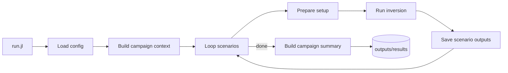

# Vendr.jl

A Julia package to orchestrate glacier inversion campaigns using the ODINN.jl ecosystem.

## Quick Start

All campaigns use the **single `Project.toml` at the root** (`../../../`). You can run from either location:

### Option 1: From the campaign directory
```bash
cd inversions/02_synthetic/21_autoAD
julia --project=../../../ run.jl
```

### Option 2: From Vendr.jl root
```bash
julia --project=. inversions/02_synthetic/21_autoAD/run.jl
```

## Campaign Structure

Each campaign directory contains:
- `config/` - TOML configuration files (`campaign.toml`, `scenarios.toml`)
- `data/` - Campaign-specific data
- `outputs/` - Results and logs
- `run.jl` - Main execution script

### Compact Run Workflow



## Current Scope (v1)

- Inversion target: `A` (scalar)
- Data mode: synthetic ground truth
- Time mode: short non-transient setup (`2010:2011`)

## Main API

- `build_campaign_run_context(campaign_root)`
- `run_campaign!(context)`

## Next Steps

The code contains explicit `TODO:` comments for planned extensions:

- Trainable `C` (creep parameter) target
- Transient configuration (longer time periods)
- Observed-data mode (without synthetic ground truth generation)
- Target-aware metrics and plots (`A` vs `C`)
- Distributed `A` and field-based error analysis
