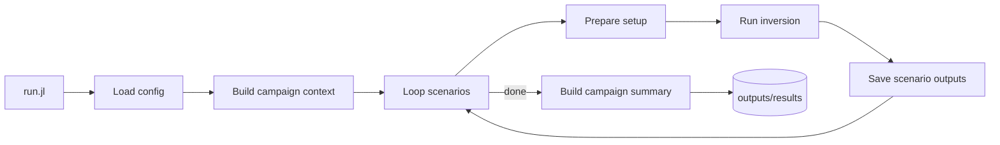

# Vendr.jl

A Julia package to run glacier inversion campaigns with ODINN.jl.

## Compact Run Workflow



## Quick Start

Run a campaign from its folder:

```bash
cd inversions/02_synthetic/21_classic_no_reg
julia --project=. run.jl
```

## Current Scope (v1)

- Inversion target: `A` (scalar)
- Data mode: synthetic ground truth
- Time mode: short non-transient setup (`2010:2011`)
- Campaign orchestration: generic API in `src/config/` + `src/simulations/`

## Main API

- `build_campaign_run_context(campaign_root)`
- `run_campaign!(context)`

## Next Steps

The code contains explicit `TODO:` comments for planned extensions:

- trainable `C` target
- transient configuration (`tspan` / `tstops` from TOML)
- observed-data mode (without synthetic ground truth generation)
- target-aware metrics and plots (`A` vs `C`)
- distributed `A` and field-based error analysis
